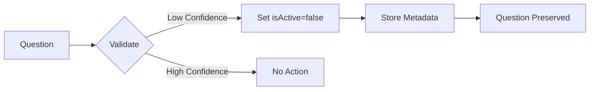
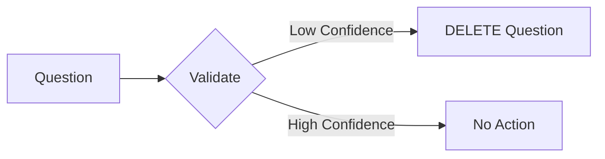

# DuckSAT Scripts Documentation

This directory contains automation scripts for managing SAT questions, validation, and database operations.

## 🔒 Safety Features

All destructive scripts have been hardened with validation and non-destructive workflows to prevent accidental data loss.

## Script Overview

### Question Management Scripts

#### `create-text-only-math.ts`
Imports text-only math questions into the database.

**Features:**
- ✅ Normalizes option strings (strips "A) ", "B) " prefixes)
- ✅ Validates correctAnswer indices before insertion
- ✅ Determines subtopic from explicit field or category fallback
- ✅ Wrapped in try/catch with error tracking
- ✅ Input validation and safe-guards

**Usage:**
```bash
npx ts-node scripts/create-text-only-math.ts
```

#### `fix-graph-questions.ts`
Fixes and normalizes graph-based math questions.

**Features:**
- ✅ Case-insensitive category matching via `categoryContains()` helper
- ✅ Validates chartData structure before DB writes
- ✅ Try/catch protection for all database operations
- ✅ Idempotency hints and error tracking
- ✅ Guards against missing/invalid chartData

**Usage:**
```bash
npx ts-node scripts/fix-graph-questions.ts
```

### Validation Scripts

#### `grok-validation.js`
Validates questions using AI and manages low-confidence items.

**⚠️ IMPORTANT - Non-Destructive by Default:**
By default, this script does NOT delete questions. Instead, it:
- Sets `isActive=false` to deactivate low-confidence questions
- Stores validation metadata in `reviewComments` field as JSON
- Preserves questions for review and potential restoration

**CLI Flags:**
- `--delete-unsafe`: Enable destructive deletion of low-confidence questions (use with caution!)

**Usage:**
```bash
# Safe mode (default) - deactivates questions, stores metadata
node grok-validation.js

# Destructive mode - permanently deletes low-confidence questions
node grok-validation.js --delete-unsafe
```

**Validation Metadata Format:**
```json
{
  "validation": {
    "isValid": true,
    "confidence": 0.65,
    "timestamp": "2025-11-13T04:00:00Z",
    "action": "deactivated"
  }
}
```

### Seed Scripts

#### `prisma/seed.ts`
Seeds the database with initial SAT questions and topics.

**Fixes Applied:**
- ✅ `wrongAnswerExplanations` uses stable string keys: `String((i) % 4)`
- ✅ Ensures `Record<string, string>` format for JSON column compatibility
- ✅ Validates array lengths and correctAnswer indices before insertion

**Usage:**
```bash
npx prisma db seed
```

## 🛡️ Data Sanitization Rules

All scripts follow these sanitization rules before database writes:

1. **Option Strings:** Always trimmed and letter prefixes removed
2. **correctAnswer:** Validated to be within bounds [0, options.length)
3. **subtopic:** Uses explicit field with category fallback
4. **chartData:** Validated for structure and required fields before insertion
5. **JSON Fields:** Use stable string keys for Prisma compatibility

## 🔍 Validation Workflow

### Non-Destructive Validation (Default)



### Destructive Validation (--delete-unsafe)



## 🚀 Running Scripts Safely

### Pre-flight Checks

Before running any script:

1. **Backup Database:**
   ```bash
   pg_dump $DATABASE_URL > backup-$(date +%Y%m%d).sql
   ```

2. **Check Environment Variables:**
   ```bash
   node scripts/check-env.js
   ```

3. **Test in Dry-Run Mode (if available):**
   ```bash
   # Check script for --dry-run support
   npx ts-node scripts/your-script.ts --help
   ```

### Recovery from Accidental Deletion

If you accidentally ran a script with `--delete-unsafe`:

1. **Restore from Backup:**
   ```bash
   psql $DATABASE_URL < backup-YYYYMMDD.sql
   ```

2. **Reactivate Questions:**
   ```sql
   UPDATE "Question" 
   SET "isActive" = true 
   WHERE "isActive" = false 
   AND "reviewComments" LIKE '%deactivated%';
   ```

## 📋 Script Checklist

Before adding a new script:

- [ ] Add input validation for all parameters
- [ ] Wrap DB operations in try/catch
- [ ] Add error counting and reporting
- [ ] Default to non-destructive behavior
- [ ] Add CLI flags for destructive operations
- [ ] Document in this README
- [ ] Test with sample data
- [ ] Add logging for audit trail

## 🔗 Related Documentation

- [Prisma Schema](../prisma/schema.prisma)
- [Seed Data README](../seeds/README.md) (if exists)
- [Environment Setup](../docs/VERCEL_ENV_SETUP.md)

## 🆘 Troubleshooting

### Common Issues

**"Cannot find module '@prisma/client'"**
```bash
npx prisma generate
```

**"DATABASE_URL not set"**
```bash
cp .env.example .env.local
# Edit .env.local with your database URL
```

**"Question already exists"**
- Scripts should be idempotent
- Check for duplicate detection logic
- Consider using `upsert` instead of `create`

## 📞 Support

For issues or questions:
1. Check error logs in console output
2. Review [GitHub Issues](https://github.com/king6870/DuckSAT/issues)
3. Contact repository maintainers

---

Last Updated: 2025-11-13
Maintained by: DuckSAT Team
